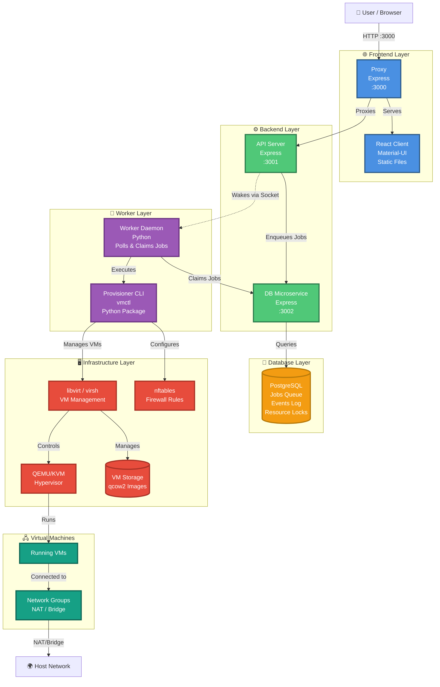

# homelab-vm-provisioner

Top-level workspace for the homelab VM provisioner web application.

This repository wires together:

- `homelab-vm-provisioner-api/`: the Express API and provisioner integration
- `homelab-vm-provisioner-client/`: the React UI
- `homelab-vm-provisioner-proxy/`: a dead-simple reverse proxy that serves the React client and proxies API requests
- root scripts that install dependencies, build both apps, run tests, and deploy the client bundle into the proxy's `public/` directory

The sub-repositories already contain their own detailed READMEs. This document covers the root project workflow.

## Architecture

```text
Browser → Proxy (port 3000) → API (port 3001) → Python CLI → libvirt
         ↓
      Static Files (React app)
```

## Workspace Layout

```text
.
|- homelab-vm-provisioner-api/
|  |- setup              # Setup API and Python provisioner
|  `- ...
|- homelab-vm-provisioner-client/
|  |- setup              # Setup client environment
|  |- build              # Build with Docker
|  `- ...
|- homelab-vm-provisioner-proxy/
|  |- setup              # Setup proxy environment
|  |- build              # Build Docker image
|  |- start              # Run in Docker
|  `- ...
|- .env.example
|- DOCKER.md
|- setup                 # Orchestrates all component setups
|- build                 # Orchestrates all builds
|- start                 # Starts all services
|- test                  # Runs all tests (supports --cli, --worker, --api, --client flags)
|- scripts/
|  `- test-docker-mode   # Test Docker setup
`- README.md
```

## Requirements

- Git with submodule support
- Node.js 18+
- npm
- Python 3 with `venv`
- Docker (optional, for containerized client builds)
- A Linux libvirt host if you want actual VM lifecycle operations to work end-to-end
- `sudo` access for the account running the API

Notes:

- Initialize submodules before the first root setup run.
- The workspace setup installs all system dependencies on supported Linux distributions: git, Node.js 18+, npm, Python, libvirt, qemu, nftables, and other VM provisioning tools.
- Supported distributions: Ubuntu/Debian, Fedora, RHEL/Rocky/AlmaLinux, Arch Linux.
- On machines where system packages are already installed, use `./setup --skip-system-packages`.

## Setup

### Prerequisites

**Required:**
- Git (for cloning and submodule management)

**Component-specific:**
- Each component will install its own system dependencies when you run its `./setup` script
- See "Component-specific setup" section below for details

**Optional:**
- Docker (if using `--docker` mode for client builds or proxy deployment)
  - **Note**: Docker installation is your responsibility. Install Docker Desktop (macOS/Windows) or Docker Engine (Linux) before running `./setup --docker`

### Fresh workspace setup

If you did not clone the repository with submodules, initialize them first:

```bash
git submodule update --init --recursive
```

Then run:

```bash
./setup
```

For Docker deployment mode:

```bash
./setup --docker
```

If you are cloning fresh, `git clone --recurse-submodules <repo>` is the simplest starting point.

What it does:

- initializes git submodules
- calls component setup scripts:
  - `homelab-vm-provisioner-api/setup` - installs system packages (Node.js, Python, libvirt, qemu, nftables) and sets up Python provisioner
  - `homelab-vm-provisioner-client/setup` - installs system packages (Node.js, npm) and client dependencies
  - `homelab-vm-provisioner-proxy/setup` - installs system packages (Node.js, npm) and proxy dependencies

**Note**: The monorepo `./setup` script is just an orchestrator. It delegates all system package installation to the component scripts.

### Component-specific setup

Each component can be set up independently with its own system package requirements:

```bash
# Setup API and Python provisioner
cd homelab-vm-provisioner-api
./setup                     # Install all system packages (Node.js, Python, libvirt, qemu, nftables)
./setup --skip-system-packages  # Skip system packages (assume already installed)
./setup --dev               # Install with dev dependencies

# Setup client
cd homelab-vm-provisioner-client
./setup                     # Install system packages (Node.js, npm)
./setup --skip-system-packages  # Skip system packages
./setup --skip-npm          # Skip npm install (for Docker builds)
./setup --skip-playwright   # Skip Playwright browser installation

# Setup proxy
cd homelab-vm-provisioner-proxy
./setup                     # Install system packages (Node.js, npm)
./setup --skip-system-packages  # Skip system packages
./setup --skip-npm          # Skip npm install (for Docker runtime)
```

**System packages installed by each component:**

- **API**: git, curl, Node.js 18+, npm, Python 3, pip, venv, libvirt, qemu, nftables, cloud-image-utils, openssh, wget
  - Also enables and starts libvirtd service
- **Client**: git, curl, Node.js 18+, npm
- **Proxy**: git, curl, Node.js 18+, npm
- **Python Provisioner** (nested in API): Python 3, pip, venv, libvirt, qemu, nftables, cloud-image-utils, openssh, wget
  - Also enables and starts libvirtd service

**Supported Linux distributions:**
- Ubuntu/Debian (Node.js from NodeSource)
- Fedora (native packages)
- RHEL/Rocky/AlmaLinux (EPEL + NodeSource)
- Arch Linux (native packages)

If your machine already has the required OS packages, use:

```bash
./setup --skip-system-packages
```

Useful pass-through options supported by the provisioner setup:

- `--skip-system-packages`: skip system package installation
- `--dev`: install Python dev dependencies (ruff, coverage, Sphinx)
- `--python <binary>`: specify Python interpreter

Note: The `--dev` flag installs dev dependencies in the Python provisioner and, when combined with `--docker`, also installs client and proxy npm packages on the host for testing (since tests don't run in containers).

Example:

```bash
./setup --skip-system-packages --python python3
```

## Configuration

The root project mostly works out of the box. The main configuration points are the root scripts and a small set of environment variables.

### Build Modes

The monorepo supports flexible deployment modes controlled by environment variables in `.env`. This allows you to enable/disable specific services:

**Environment variables:**
```bash
ENABLE_CLIENT=true       # React frontend + reverse proxy
ENABLE_API=true          # Express API + Python provisioner  
ENABLE_DB_SERVICE=true   # Node.js microservice for job queue
ENABLE_DB=true           # PostgreSQL database
```

**Common deployment modes:**

1. **Full stack (default)**: All services enabled
   ```bash
   # All variables true (default)
   ./setup && ./build && ./start
   ```

2. **Client only**: Frontend connecting to remote API
   ```bash
   ENABLE_CLIENT=true
   ENABLE_API=false
   ENABLE_DB_SERVICE=false
   ENABLE_DB=false
   
   # Or use legacy flag:
   ./setup --client-only
   ./build --client-only
   API_HOST=http://remote-api:3001 ./start --client-only
   ```

3. **API only**: Backend without frontend
   ```bash
   ENABLE_CLIENT=false
   ENABLE_API=true
   ENABLE_DB_SERVICE=true
   ENABLE_DB=true
   
   ./setup && ./build && ./start
   # API on port 3001, DB service on 3002
   ```

4. **Database standalone**: PostgreSQL + microservice only
   ```bash
   ENABLE_CLIENT=false
   ENABLE_API=false
   ENABLE_DB_SERVICE=true
   ENABLE_DB=true
   
   cd homelab-vm-provisioner-db
   ./setup && ./build --docker && ./start --docker
   ```

5. **Database service only**: Microservice without PostgreSQL (requires external DB)
   ```bash
    ENABLE_DB_SERVICE=true
    ENABLE_DB=false
    POSTGRES_HOST=external-host
    POSTGRES_PORT=5432
    POSTGRES_USER=user
    POSTGRES_PASSWORD=pass
    POSTGRES_DB=dbname
    
    # Microservice connects to external PostgreSQL
    ```

6. **PostgreSQL only**: Database without microservice
   ```bash
   ENABLE_DB=true
   ENABLE_DB_SERVICE=false
   
   # Exposes PostgreSQL port 5432
   ```

**Setting modes:** Copy `.env.example` to `.env` and set the desired flags, or export them in your shell:

```bash
cp .env.example .env
# Edit .env to set ENABLE_* variables

# Or export directly:
export ENABLE_CLIENT=true ENABLE_API=false
./setup && ./build && ./start
```

**Legacy flag support:** The `--client-only` flag is still supported and automatically sets the appropriate mode flags.

### Root scripts

- `./setup`: installs dependencies and configures environments (git submodules, Python venv, npm packages, Playwright)
- `./setup --docker`: setup for Docker mode (skips client and proxy npm installs since they run in containers)
- `./setup --dev`: setup with dev dependencies for the Python provisioner
- `./setup --docker --dev`: Docker mode with dev dependencies installed on host for testing
- `./build`: builds documentation and app artifacts (no tests)
- `./build --docker`: builds client static files using Docker instead of local Node.js
- `./homelab-vm-provisioner-client/build`: standalone script to build only client static files with Docker
- `./homelab-vm-provisioner-proxy/build`: builds the proxy Docker image
- `./homelab-vm-provisioner-db/build --docker`: builds the database Docker image
- `./test`: runs all tests with coverage across Python CLI, Worker, API, and Client (supports `--cli`, `--worker`, `--api`, `--client` flags for selective testing, or `--env` to test only components enabled in `.env`)
- `./start`: starts enabled services (controlled by ENABLE_* variables in .env)
- `./start --docker`: starts enabled DB services, API, and proxy in Docker, with the worker running locally
- `./docker-clean`: stops and removes the workspace Docker containers (`hlvmp-db`, `hlvmp-api`, `hlvmp-proxy`)
- `./homelab-vm-provisioner-proxy/start`: runs the proxy in a Docker container (requires static files in `public/`)
- `./homelab-vm-provisioner-db/start --docker`: runs PostgreSQL and/or microservice in Docker container

**Note:** Build modes are controlled by environment variables (`ENABLE_CLIENT`, `ENABLE_API`, `ENABLE_DB_SERVICE`, `ENABLE_DB`). See the "Build Modes" section above.

### Docker commands

```bash
# Setup for Docker mode
./setup --docker

# Build Docker images
./homelab-vm-provisioner-client/build   # Build client static files
./homelab-vm-provisioner-proxy/build    # Build proxy image
./homelab-vm-provisioner-db/build --docker  # Build database image

# Start services in Docker
./start --docker                        # All enabled services
./homelab-vm-provisioner-proxy/start    # Proxy only
./homelab-vm-provisioner-db/start --docker  # Database service
```

### Client-only workflow (frontend development)

For frontend developers who don't need the full API stack locally:

**Using environment variables (recommended):**
```bash
# .env file
ENABLE_CLIENT=true
ENABLE_API=false
ENABLE_DB_SERVICE=false
ENABLE_DB=false
API_HOST=http://remote-api-server:3001

./setup
./build
./start
```

**Using legacy --client-only flag:**
```bash
# One-time setup (skips Python provisioner and API dependencies)
./setup --client-only

# Build and start (connects to remote API)
./build --client-only
API_HOST=http://192.168.1.100 ./start --client-only

# Or combine with Docker
./setup --client-only --docker
./build --client-only --docker
./start --client-only --docker
```

**Configuration**: Copy `.env.example` to `.env` and customize:
```bash
cp .env.example .env
# Edit .env to set PROXY_PORT, API_PORT, API_HOST, etc.
```

Or set environment variables directly:
```bash
PROXY_PORT=8080 API_PORT=8081 ./start --docker
```

### Environment Variables (.env)

The project uses a **hierarchical .env configuration system** where component `.env` files override parent values through natural script execution sequence:

**Structure:**
```
workspace/.env                                    # Loaded by workspace scripts
├── homelab-vm-provisioner-api/.env              # Loaded by API scripts (overrides workspace)
│   └── homelab-vm-provisioner-cli/.env          # Loaded by provisioner scripts (overrides API & workspace)
├── homelab-vm-provisioner-client/.env           # Loaded by client scripts (overrides workspace)
└── homelab-vm-provisioner-proxy/.env            # Loaded by proxy scripts (overrides workspace)
```

**How hierarchy works:**
1. Parent script sources workspace `.env`
2. Parent script calls child script (child inherits environment variables)
3. Child script sources only its own `.env` (overrides inherited values)
4. Variables not in child `.env` remain from parent (inheritance)

**Example execution flow:**
```bash
./setup
  ├─ Sources workspace/.env (API_PORT=3001, PROXY_PORT=3000)
  ├─ Calls homelab-vm-provisioner-api/setup
  │   ├─ Inherits API_PORT=3001, PROXY_PORT=3000
  │   ├─ Sources api/.env (API_PORT=4001)  # Override
  │   └─ Result: API_PORT=4001, PROXY_PORT=3000  # Kept from parent
  └─ Calls homelab-vm-provisioner-proxy/setup
      ├─ Inherits API_PORT=3001, PROXY_PORT=3000
      ├─ Sources proxy/.env (PROXY_PORT=8080)  # Override
      └─ Result: API_PORT=3001, PROXY_PORT=8080  # Kept from parent
```

**Key principle:** Children never load parent `.env` files. They only load their own. Hierarchy happens naturally through execution sequence and environment variable inheritance.

**Setup:**
```bash
# Copy all example files
cp .env.example .env
cp homelab-vm-provisioner-api/.env.example homelab-vm-provisioner-api/.env
cp homelab-vm-provisioner-client/.env.example homelab-vm-provisioner-client/.env
cp homelab-vm-provisioner-proxy/.env.example homelab-vm-provisioner-proxy/.env
cp homelab-vm-provisioner-cli/.env.example homelab-vm-provisioner-cli/.env

# Customize as needed
```

**Variable ownership:**
- **Workspace**: Sets defaults for all components
- **Components**: Override specific values, inherit the rest
- **Example**: Set `API_PORT=3001` in workspace, override with `API_PORT=4001` in API component

**Common variables:**
- `PROXY_PORT` - Proxy server port (default: 3000)
- `API_PORT` - API server port (default: 3001)
- `API_HOST` - API host for proxy (default: 172.17.0.1 for Docker, localhost for native)
- `PROVISIONER_VENV_DIR` - Python provisioner virtualenv path
- `HLVMP_NETWORK_POOL_CIDR` - VM network pool CIDR
- `HLVMP_NETWORK_GROUP_PREFIX_LENGTH` - VM network group prefix length

### Client-only mode (remote API)

Use `--client-only` to run just the frontend proxy without starting the local API. This is useful for:
- Connecting to a remote API server
- Frontend development without running the full stack locally
- Multiple developers sharing a single API instance

```bash
# Build client and start proxy, connecting to remote API
API_HOST=http://192.168.1.100 ./start --client-only

# Or configure in .env
echo "API_HOST=http://remote-server" >> .env
echo "API_PORT=3001" >> .env
./start --client-only

# With Docker proxy
./start --client-only --docker
```

The `--client-only` flag:
1. Builds the client (locally or with Docker if `--docker` is specified)
2. Deploys static files to the proxy
3. Starts only the proxy (skips API startup)
4. Uses `API_HOST` and `API_PORT` to construct the API URL

### Environment variables

| Variable | Default | Used by | Purpose |
| --- | --- | --- | --- |
| `PROVISIONER_VENV_DIR` | `homelab-vm-provisioner-cli/.venv` | `./setup`, `./start` | Location of the provisioner virtual environment |
| `PROVISIONER_DATA_DIR` | `homelab-vm-provisioner-cli/data` in root `.env`, `data` in CLI `.env` | CLI, API, worker | Provisioner data root; root-level relative values are rewritten relative to the CLI checkout before use |
| `PORT` | `3000` (proxy), `3001` (API) | Proxy and API | HTTP ports for the services |
| `API_URL` | `http://localhost:3001` | Proxy | Backend API URL (constructed from API_HOST + API_PORT) |
| `PROVISIONER_CLI_PATH` | `homelab-vm-provisioner-cli` | `./setup`, `./start`, API, worker | Override the provisioner checkout path |
| `HLVMP_API_RUNTIME_DIR` | `homelab-vm-provisioner-api/runtime` | API | Legacy runtime directory used for startup migration |
| `HLVMP_NETWORK_POOL_CIDR` | `10.80.0.0/16` | API | Global private pool used to allocate per-network-group subnets |
| `HLVMP_NETWORK_GROUP_PREFIX_LENGTH` | `28` | API | Prefix length allocated to each managed network group |
| `HLVMP_PYTHON_BIN` | set automatically by `./start` | API | Python executable used by the API bridge |
| `VITE_API_BASE_URL` | unset | client dev/build | Optional API base URL when running the client separately from the API |

Examples:

```bash
PROVISIONER_VENV_DIR="$HOME/.local/share/hlvmp/.venv" ./setup --skip-system-packages
PORT=4000 ./start
VITE_API_BASE_URL=http://localhost:3000 npm --prefix homelab-vm-provisioner-client run dev
```

### Generated and runtime paths

After setup and use, the workspace relies on these paths:

- `homelab-vm-provisioner-proxy/public/`: deployed client bundle served by the reverse proxy
- `homelab-vm-provisioner-cli/data/configs/`: saved VM YAML configs
- `homelab-vm-provisioner-cli/data/vm/metadata/`: persisted tenant and network-group records
- `homelab-vm-provisioner-cli/data/vm/keys/users/`: uploaded SSH public keys
- `homelab-vm-provisioner-cli/data/vm/data/`: provisioner VM data

## Tenant Networking

The workspace now uses tenant-owned network groups instead of one flat VM network.

- each network group maps to one libvirt network and one small subnet, default `/28`
- new groups allocate subnets from `HLVMP_NETWORK_POOL_CIDR`, default `10.80.0.0/16`
- VMs in the same group can talk by default
- hypervisor host access is allowed by default and can be disabled per VM
- cross-group traffic is denied by default
- private LAN access is denied by default and can be enabled per VM for admin-owned VMs
- internet egress is available through NAT-backed profiles without exposing private RFC1918 LANs by default

Managed VM and network-group policy now reconciles through application-owned nftables tables. See `homelab-vm-provisioner-api/docs/vm-networking-nftables.md`.

## Running

### Bundled root-project run

After `./setup` completes, build and start the workspace from the root with:

```bash
./build
./start
```

This command:

- verifies the built client exists in `homelab-vm-provisioner-api/public/`
- verifies the provisioner virtual environment exists
- exports `HLVMP_PYTHON_BIN` to the provisioner venv's Python interpreter
- starts the API, which also serves the built client

Open:

```text
http://localhost:3000
```

Notes:

- Start the API from an interactive terminal.
- On startup, the API may prompt for `sudo` so later `virsh` and libvirt operations can run correctly.

### Split development mode

If you want live frontend reloads, run the API and client separately.

Terminal 1:

```bash
./start
```

Terminal 2:

```bash
npm --prefix homelab-vm-provisioner-client run dev
```

Then open:

```text
http://localhost:5173
```

By default, the Vite dev server proxies `/api` and `/health` to `http://localhost:3000`.

If the API is running elsewhere, set `VITE_API_BASE_URL` before starting the client.

## Rebuilding

To rerun the root build without reinstalling dependencies:

```bash
./build
```

This runs:

- API tests, coverage, and docs build
- client tests, coverage, app build, and docs build
- client Playwright e2e tests
- client bundle deployment into the API `public/` directory

## Testing

To run tests across all subprojects and see a consolidated coverage report:

```bash
./test              # Run all tests
./test --cli        # Run only CLI tests
./test --worker     # Run only Worker tests
```

This runs:

- Python CLI tests with coverage (homelab-vm-provisioner-cli)
- Node.js API tests with coverage (homelab-vm-provisioner-api)
- React Client tests with coverage (homelab-vm-provisioner-client)

The script displays a color-coded summary showing:

- Test pass/fail status for each project
- Number of tests run
- Coverage percentage for each project
- Overall workspace test health

Example output:

```text
━━━━━━━━━━━━━━━━━━━━━━━━━━━━━━━━━━━━━━━━━━━━━━━━━━━━━
  1/3 Python CLI (homelab-vm-provisioner-cli)
━━━━━━━━━━━━━━━━━━━━━━━━━━━━━━━━━━━━━━━━━━━━━━━━━━━━━
✓ Python CLI
  Tests:    275 tests (all passed)
  Coverage: 86%

━━━━━━━━━━━━━━━━━━━━━━━━━━━━━━━━━━━━━━━━━━━━━━━━━━━━━
  2/3 Node.js API (homelab-vm-provisioner-api)
━━━━━━━━━━━━━━━━━━━━━━━━━━━━━━━━━━━━━━━━━━━━━━━━━━━━━
✓ Node.js API
  Tests:    111 tests passed
  Coverage: 87.09%

━━━━━━━━━━━━━━━━━━━━━━━━━━━━━━━━━━━━━━━━━━━━━━━━━━━━━
  3/3 React Client (homelab-vm-provisioner-client)
━━━━━━━━━━━━━━━━━━━━━━━━━━━━━━━━━━━━━━━━━━━━━━━━━━━━━
✓ React Client
  Tests:    31 tests passed
  Coverage: 74.64%

━━━━━━━━━━━━━━━━━━━━━━━━━━━━━━━━━━━━━━━━━━━━━━━━━━━━━
  SUMMARY
━━━━━━━━━━━━━━━━━━━━━━━━━━━━━━━━━━━━━━━━━━━━━━━━━━━━━

  ✓ Python CLI: 275 tests (all passed), Coverage 86%
  ✓ Node.js API: 111 tests passed, Coverage 87.09%
  ✓ React Client: 31 tests passed, Coverage 74.64%

✓ All tests passed!
```

For individual project testing, see the respective subproject documentation.

## Subproject Docs

For service-specific details, see:

- `homelab-vm-provisioner-api/README.md`
- `homelab-vm-provisioner-client/README.md`
- `homelab-vm-provisioner-cli/README.md`
- `homelab-vm-provisioner-db/README.md`
- `homelab-vm-provisioner-proxy/README.md`
- `homelab-vm-provisioner-worker/README.md`

---

# System Architecture

## Overview

This is a full-stack web application for managing KVM/libvirt VMs with a React frontend, Express backend, PostgreSQL job queue, and Python provisioning engine.

## Components

### Frontend Layer

**[homelab-vm-provisioner-client](homelab-vm-provisioner-client/)**
- React 18 + Vite
- Material-UI (MUI) v7 dark mode
- VM inventory grid with status chips
- VM create/clone/start/stop/destroy operations
- Snapshot management (create, restore, delete)
- Live log streaming via Server-Sent Events
- Network group and user management
- Port forwarding configuration
- Playwright E2E tests

**[homelab-vm-provisioner-proxy](homelab-vm-provisioner-proxy/)**
- Express reverse proxy
- Serves static React client from `public/`
- Proxies API requests to backend
- Eliminates CORS, single origin for frontend and backend
- Minimal implementation (no tests, no build step)

### Backend Layer

**[homelab-vm-provisioner-api](homelab-vm-provisioner-api/)**
- Express API server (port 3001)
- REST endpoints for VM operations
- Enqueues async jobs to database
- Validates VM configs (Zod schemas)
- Manages tenant/network-group metadata
- Stores VM configs as YAML files
- SSH key and setup script management
- Integrates with Python provisioner via service-mode APIs
- Vitest + supertest for testing

**[homelab-vm-provisioner-db](homelab-vm-provisioner-db/)**
- PostgreSQL database (jobs, events, locks, VM state)
- Express microservice (port 3002) exposing job queue REST API
- Internal API (not exposed to users)
- Authentication via shared secret (DB_SERVICE_PASSWORD)
- Migrations in `migrations/` directory
- Job lifecycle: queued → running → succeeded/failed
- Event logging per job for debugging
- Resource locking to prevent concurrent operations

**[homelab-vm-provisioner-worker](homelab-vm-provisioner-worker/)**
- Python daemon that polls database for jobs
- Claims jobs using PostgreSQL row-level locking
- Executes `vmctl` commands (provision, destroy, clone, start, stop, etc.)
- Acquires resource locks before execution (vm:<name>, network:<host>, firewall:<host>)
- Appends events to job log throughout execution
- Supports concurrent job execution (configurable)
- Graceful shutdown (waits for active jobs)
- 80% test coverage requirement (unittest)

### Provisioning Layer

**[homelab-vm-provisioner-cli](homelab-vm-provisioner-cli/)**
- Python 3.9+ CLI for libvirt/KVM provisioning
- Commands: create, destroy, start, stop, clone, snapshot-*, reconcile, ssh-admin
- Cloud-init based VM configuration
- Automatic subnet allocation for NAT networks
- Managed network groups with nftables firewall rules
- Port forwarding support
- Per-VM admin SSH key generation
- User SSH key injection
- Stdin support for database-driven configs
- Service-mode APIs for programmatic integration
- 75% test coverage requirement (unittest)
- Sphinx documentation

## Data Flow

### VM Provisioning (Async)

```
1. User creates VM via client UI
2. Client sends POST /api/configs to API
3. API validates config and enqueues job to database
4. Worker polls database and claims job
5. Worker acquires resource locks
6. Worker executes vmctl create <config>
7. CLI provisions VM via libvirt
8. CLI reconciles nftables firewall rules
9. Worker marks job as succeeded
10. Client polls job status and refreshes VM list
```

### VM Status Refresh (Sync)

```
1. Client sends GET /api/vms to API
2. API reads saved configs from filesystem
3. API calls CLI service-mode API for runtime state
4. CLI queries libvirt for VM status, IP, network info
5. API merges config + runtime state
6. API returns JSON to client
```

### Network Reconciliation

```
1. API or CLI detects network changes
2. Reconciler computes desired nftables rules
3. Reconciler validates changes (prevent routing loops, orphans)
4. Reconciler generates nftables ruleset
5. Reconciler applies rules via sudo nft -f
6. Reconciler verifies rules loaded correctly
7. On failure, rolls back to previous ruleset
```

## Network Architecture

### Tenant Isolation

- One user record per tenant
- One network group per tenant (mapped to libvirt network)
- One /28 subnet per network group (default, configurable)
- Subnets allocated from global pool (10.80.0.0/16 default)
- VMs in same group can communicate (configurable per-VM)
- Cross-group traffic denied by default
- Internet access via NAT (configurable per-VM)
- Private LAN access denied by default (admin-only override)

### Firewall Management

Application-owned nftables tables:
- `hvp_nat`: NAT rules for VM internet access and port forwarding
- `hvp_filter`: Filter rules for VM-to-VM, VM-to-host, VM-to-internet traffic
- `hvp_bridge_filter`: Bridge filter rules for same-subnet isolation

Rules are reconciled on:
- VM creation/destruction
- Network config changes
- Port forwarding updates
- Policy toggle changes (same-group traffic, internet access, etc.)

See [API docs/vm-networking-nftables.md](homelab-vm-provisioner-api/docs/vm-networking-nftables.md) for full details.

## Database Schema

### Jobs Table
- `id`: Job primary key
- `type`: Job type (provision_vm, destroy_vm, clone_vm, etc.)
- `status`: queued, running, succeeded, failed, cancelled
- `target_host_id`: Host where job should run
- `target_vm_id`: Target VM name (nullable)
- `payload`: JSON job parameters
- `result`: JSON job result (on success)
- `error`: Error message (on failure)
- `claimed_by`: Worker ID that claimed job
- `attempts`: Execution attempt counter
- `max_attempts`: Retry limit (default 3)
- Timestamps: created_at, claimed_at, started_at, finished_at, updated_at

### Job Events Table
- `id`: Event primary key
- `job_id`: Foreign key to jobs
- `level`: debug, info, warning, error
- `message`: Event message
- `metadata`: JSON additional context
- `created_at`: Event timestamp

### Resource Locks Table
- `lock_key`: Lock identifier (vm:name, network:host, etc.)
- `job_id`: Job holding the lock
- `worker_id`: Worker holding the lock
- `expires_at`: Lock expiration timestamp

See [database migrations](homelab-vm-provisioner-db/migrations/) for full schema.

## Configuration

### Hierarchical .env System

The project uses hierarchical `.env` configuration:

```
workspace/.env                          # Workspace defaults
├── homelab-vm-provisioner-api/.env    # API overrides
│   └── homelab-vm-provisioner-cli/.env # Provisioner overrides
├── homelab-vm-provisioner-client/.env  # Client overrides
├── homelab-vm-provisioner-proxy/.env   # Proxy overrides
├── homelab-vm-provisioner-db/.env      # Database overrides
└── homelab-vm-provisioner-worker/.env  # Worker overrides
```

**How it works:**
1. Parent script sources workspace `.env`
2. Parent calls child script (child inherits environment)
3. Child sources only its own `.env` (overrides inherited values)
4. Variables not in child `.env` remain from parent

**Example:**
- Workspace sets `API_PORT=3001`
- API component overrides with `API_PORT=4001`
- Client inherits `API_PORT=3001` (no override)

### Key Environment Variables

| Variable | Default | Component | Description |
|----------|---------|-----------|-------------|
| `PROXY_PORT` | 3000 | Proxy | Proxy server port |
| `API_PORT` | 3001 | API | API server port |
| `DB_SERVICE_PORT` | 3002 | Database | Database microservice port |
| `DB_SERVICE_URL` | http://localhost:3002 | API, Worker | Database microservice URL |
| `DB_SERVICE_PASSWORD` | changeme_db_secret | API, Worker, DB | Shared secret for DB authentication |
| `HOST_ID` | (required) | API, Worker | Host identifier for job targeting |
| `PROVISIONER_CLI_PATH` | ../homelab-vm-provisioner-cli | API, Worker | Path to CLI package |
| `PROVISIONER_CONCURRENCY` | 1 | Worker | Max concurrent jobs |
| `WORKER_POLL_INTERVAL` | 5.0 | Worker | Poll interval in seconds |
| `HLVMP_NETWORK_POOL_CIDR` | 10.80.0.0/16 | API | Global network pool |
| `HLVMP_NETWORK_GROUP_PREFIX_LENGTH` | 28 | API | Network group subnet size |
| `ENABLE_CLIENT` | true | Workspace | Enable client/proxy |
| `ENABLE_API` | true | Workspace | Enable API |
| `ENABLE_DB_SERVICE` | true | Workspace | Enable DB microservice |
| `ENABLE_DB` | true | Workspace | Enable PostgreSQL |
| `ENABLE_WORKER` | true | Workspace | Enable worker daemon |

See `.env.example` files in each component for complete lists.

## Deployment Modes

### Full Stack (Default)

All components enabled:

```bash
./setup
./build
./start
```

Services:
- PostgreSQL (port 5432)
- Database microservice (port 3002)
- API (port 3001)
- Worker daemon (polls every 5s)
- Proxy (port 3000)

Access: http://localhost:3000

### Docker Mode

Database, API, and proxy in Docker; worker on host:

```bash
./setup --docker
./start --docker
```

Containers:
- `hlvmp-db`: PostgreSQL + microservice
- `hlvmp-api`: Express API
- `hlvmp-proxy`: Reverse proxy

Worker runs on host (requires libvirt access).

### Client Only

Frontend connecting to remote API:

```bash
ENABLE_CLIENT=true
ENABLE_API=false
ENABLE_DB_SERVICE=false
ENABLE_DB=false
API_HOST=http://remote-api:3001

./setup
./build
./start
```

### API Only

Backend without frontend:

```bash
ENABLE_CLIENT=false
ENABLE_API=true
ENABLE_DB_SERVICE=true
ENABLE_DB=true

./setup
./build
./start
```

## Security Considerations

### Current State

**No authentication/authorization implemented yet.** The system assumes a trusted network environment.

### What Needs Protection

1. **API Endpoints**: All VM operations are unauthenticated
2. **Database Service**: Protected only by shared secret (DB_SERVICE_PASSWORD)
3. **Worker**: No authentication (assumes trusted environment)
4. **SSH Keys**: Stored as plain text files
5. **Setup Scripts**: Executed without validation

### Recommendations for Production

1. Add JWT-based authentication to API
2. Implement user sessions and RBAC
3. Encrypt sensitive data at rest
4. Add TLS/HTTPS support
5. Implement rate limiting
6. Add audit logging
7. Validate setup scripts before execution
8. Use secrets management (Vault, etc.)
9. Network isolation (firewall rules, VLANs)
10. Regular security audits

## Performance

### Resource Requirements

**Minimum:**
- CPU: 4 cores
- RAM: 8 GB
- Disk: 50 GB SSD
- Network: 1 Gbps

**Recommended:**
- CPU: 8+ cores
- RAM: 16+ GB
- Disk: 100+ GB NVMe SSD
- Network: 10 Gbps

### Scaling Considerations

**Worker Concurrency:**
- Start with `PROVISIONER_CONCURRENCY=1`
- Increase cautiously based on host resources
- VM provisioning is I/O-intensive (disk copying, image downloads)

**Database:**
- PostgreSQL can handle hundreds of concurrent workers
- Use connection pooling for high-load scenarios
- Monitor lock contention in `resource_locks` table

**Network:**
- Each network group uses one /28 subnet (14 usable IPs)
- Default pool (10.80.0.0/16) supports 4096 network groups
- Adjust `HLVMP_NETWORK_POOL_CIDR` and `HLVMP_NETWORK_GROUP_PREFIX_LENGTH` for larger deployments

## Limitations

1. **No multi-host support**: Worker only processes jobs for single `HOST_ID`
2. **No VM live migration**: VMs cannot be moved between hosts
3. **No automatic failover**: Worker crash requires manual intervention
4. **No stale job recovery**: Stuck jobs require manual cleanup
5. **Limited network modes**: NAT and bridge only (no VLAN, SR-IOV, etc.)
6. **No GPU passthrough**: Only CPU/RAM/disk/network virtualization
7. **No nested virtualization**: VMs cannot run VMs
8. **No HA/clustering**: Single point of failure
9. **Local storage only**: No shared storage (NFS, Ceph, etc.)
10. **Docker constraints**: Worker cannot run in container (needs libvirt access)

## Troubleshooting

### API won't start

**Check:**
- Python provisioner venv exists: `ls homelab-vm-provisioner-cli/.venv`
- Node.js dependencies installed: `ls homelab-vm-provisioner-api/node_modules`
- Port 3001 is available: `lsof -i :3001`
- Libvirt is running: `sudo systemctl status libvirtd`

### Worker not claiming jobs

**Check:**
- Worker is running: `ps aux | grep hlvmp_worker`
- `HOST_ID` matches job `target_host_id`
- Database connection: `curl http://localhost:3002/health`
- Worker logs: `journalctl -u hlvmp-worker -f`

### VM provisioning fails

**Check:**
- Libvirt is running: `sudo systemctl status libvirtd`
- QEMU/KVM installed: `which qemu-system-x86_64`
- libvirt permissions: `sudo usermod -a -G libvirt $USER`
- nftables loaded: `sudo nft list tables`
- Disk space: `df -h /var/lib/libvirt/images`

### Frontend shows blank page

**Check:**
- Static files exist: `ls homelab-vm-provisioner-proxy/public/index.html`
- Proxy is running: `curl http://localhost:3000/proxy-health`
- API is reachable: `curl http://localhost:3001/health`
- Browser console for JavaScript errors

### Logs not streaming

**Check:**
- VM log file exists: `ls /var/log/libvirt/qemu/<vm>.log`
- Log file permissions: `sudo chmod 644 /var/log/libvirt/qemu/<vm>.log`
- API has read access: `sudo usermod -a -G libvirt $USER`

---

# System Architecture Diagram



## Diagram Legend

### 🌐 Frontend Layer (Blue)
- **Proxy**: Reverse proxy serving static files and proxying API requests (port 3000)
- **React Client**: Material-UI dark mode SPA for VM management

### ⚙️ Backend Layer (Green)
- **API Server**: Express REST API for VM operations (port 3001)
- **DB Microservice**: Internal API for job queue operations (port 3002)

### 💾 Database Layer (Orange)
- **PostgreSQL**: Job queue, event log, resource locks, VM state

### 🔧 Worker Layer (Purple)
- **Worker Daemon**: Polls database, claims jobs, executes vmctl commands
- **Provisioner CLI**: Python package with vmctl commands for VM lifecycle

### 🖥️ Infrastructure Layer (Red)
- **libvirt/virsh**: VM lifecycle and network management
- **QEMU/KVM**: Hypervisor for running VMs
- **nftables**: Firewall rules for VM networking and isolation
- **VM Storage**: qcow2 disk images on host filesystem

### 🖧 Virtual Machines Layer (Teal)
- **Running VMs**: Active virtual machines
- **Network Groups**: Isolated subnets for tenant VMs (NAT/Bridge modes)

## Key Connections

### Primary Async Flow (Solid Lines)
1. **User → Proxy → API**: User requests via web UI
2. **API → DB Service → PostgreSQL**: API enqueues jobs to database
3. **API ⤍ Worker**: API wakes worker via Unix socket (optional)
4. **Worker → DB Service**: Worker polls and claims jobs
5. **Worker → CLI → libvirt**: Worker executes vmctl commands

### Infrastructure (Solid Lines)
- **CLI → libvirt**: Manages VMs and networks
- **CLI → nftables**: Configures firewall rules
- **libvirt → QEMU**: Controls hypervisor
- **QEMU → VMs**: Runs virtual machines

## Data Flow Patterns

### Async VM Provisioning (Primary Flow)
```
User → Proxy → API → DB Service → PostgreSQL
                ↓                      ↓
            Wake Worker          Worker polls & claims job
                                      ↓
                                Worker → vmctl → libvirt → QEMU
```

1. User creates VM via web UI
2. API validates config and enqueues job to database
3. API wakes worker via Unix socket (optional, reduces latency)
4. Worker polls database and claims job using row-level locking
5. Worker acquires resource locks (vm:<name>, network:<host>, etc.)
6. Worker executes vmctl command
7. CLI provisions VM via libvirt and configures nftables
8. Worker marks job as succeeded/failed with event log

### VM Status Refresh (Sync Query)
```
User → Proxy → API → Read VM configs from filesystem
                  ↓
               Query libvirt for runtime state
                  ↓
               Merge config + runtime → Return to user
```

### Live Log Streaming (Server-Sent Events)
```
User ← Proxy ← API ← tail -f /var/log/libvirt/qemu/<vm>.log
  (SSE connection with keep-alive)
```

### Network Reconciliation
```
API or CLI detects network changes
       ↓
Reconciler computes desired nftables rules
       ↓
Validate changes (prevent loops, orphans)
       ↓
Generate and apply nftables ruleset (hvp_nat, hvp_filter, hvp_bridge_filter)
       ↓
Verify rules loaded correctly (rollback on failure)
```

---
